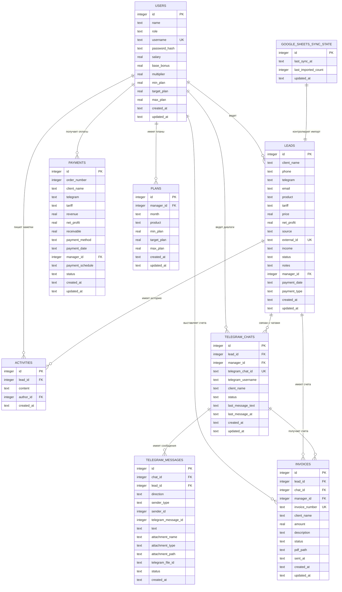

# CRM Builder: схема SQLite-базы

Файл базы для локального запуска:

```text
data/crm.sqlite
```

Текущая CRM работает с пятью основными сущностями: сотрудники, заявки, оплаты, планы и история действий по заявкам. Для локальной разработки выбрана SQLite-база: ее не нужно поднимать через Docker, она хранится одним файлом и подходит для текущего объема данных из Excel.

## Наглядная схема



## Таблицы

### `users`

Сотрудники и права доступа.

| Поле | Тип | Назначение |
| --- | --- | --- |
| `id` | `integer primary key autoincrement` | ID сотрудника |
| `name` | `text not null` | Имя сотрудника |
| `role` | `text not null default 'manager'` | Роль: `admin` или `manager` |
| `username` | `text not null unique` | Логин |
| `password_hash` | `text not null` | Хеш пароля |
| `salary` | `real` | Оклад |
| `base_bonus` | `real` | Базовая премия |
| `multiplier` | `real` | Коэффициент премии после целевого плана |
| `min_plan` | `real` | План-минимум по умолчанию |
| `target_plan` | `real` | Целевой план по умолчанию |
| `max_plan` | `real` | Максимальный план по умолчанию |
| `created_at` | `text` | Дата создания записи |
| `updated_at` | `text` | Дата обновления записи |

### `leads`

Заявки для Kanban-доски.

| Поле | Тип | Назначение |
| --- | --- | --- |
| `id` | `integer primary key autoincrement` | ID заявки |
| `client_name` | `text not null` | Имя клиента |
| `phone` | `text` | Телефон |
| `telegram` | `text` | Telegram или другой контакт |
| `email` | `text` | Email |
| `product` | `text` | Продукт |
| `tariff` | `text` | Тариф |
| `price` | `real` | Сумма тарифа или ожидаемая выручка |
| `net_profit` | `real` | Ожидаемая или фактическая чистая прибыль |
| `source` | `text` | Источник данных, например Excel или Google Sheets |
| `external_id` | `text unique` | Внешний ключ импорта, чтобы не задваивать заявки из Google Sheets |
| `income` | `text` | Доход/сегмент клиента из Excel |
| `status` | `text not null default 'new'` | Статус Kanban: `new`, `in_progress`, `proposal_sent`, `waiting_decision`, `paid`, `lost` |
| `notes` | `text` | Запрос, комментарии и исходный статус из Excel |
| `manager_id` | `integer not null` | Ответственный сотрудник |
| `payment_date` | `text` | Дата заявки или оплаты в формате `YYYY-MM-DD` |
| `payment_type` | `text` | Способ/тип оплаты |
| `created_at` | `text` | Дата создания записи |
| `updated_at` | `text` | Дата обновления записи |

### `payments`

Оплаты и финансовая статистика.

| Поле | Тип | Назначение |
| --- | --- | --- |
| `id` | `integer primary key autoincrement` | ID оплаты |
| `order_number` | `integer` | Номер заказа из Excel |
| `client_name` | `text not null` | Клиент |
| `telegram` | `text` | Контакт |
| `tariff` | `text not null` | Тариф |
| `revenue` | `real not null` | Выручка |
| `net_profit` | `real` | Чистая прибыль |
| `receivable` | `real` | Дебиторка |
| `payment_method` | `text` | Способ оплаты |
| `payment_date` | `text not null` | Дата оплаты `YYYY-MM-DD` |
| `manager_id` | `integer not null` | Ответственный сотрудник |
| `payment_schedule` | `text` | График платежей или отметка импорта |
| `status` | `text default 'paid'` | Статус оплаты |
| `created_at` | `text` | Дата создания записи |
| `updated_at` | `text` | Дата обновления записи |

### `plans`

Планы по сотрудникам и месяцам.

| Поле | Тип | Назначение |
| --- | --- | --- |
| `id` | `integer primary key autoincrement` | ID плана |
| `manager_id` | `integer not null` | Сотрудник |
| `month` | `text not null` | Месяц в формате `YYYY-MM` |
| `product` | `text` | Продукт или источник плана |
| `min_plan` | `real not null` | План-минимум |
| `target_plan` | `real not null` | Целевой план |
| `max_plan` | `real not null` | Максимальный план |
| `created_at` | `text` | Дата создания записи |
| `updated_at` | `text` | Дата обновления записи |

### `activities`

История заметок и действий по заявкам.

| Поле | Тип | Назначение |
| --- | --- | --- |
| `id` | `integer primary key autoincrement` | ID действия |
| `lead_id` | `integer not null` | Заявка |
| `content` | `text not null` | Текст заметки |
| `author_id` | `integer` | Автор |
| `created_at` | `text` | Дата создания записи |

### `google_sheets_sync_state`

Состояние автоматической загрузки заявок из опубликованной Google-таблицы.

| Поле | Тип | Назначение |
| --- | --- | --- |
| `id` | `integer primary key` | Единственная строка состояния |
| `last_sync_at` | `text` | Последняя попытка синхронизации |
| `last_imported_count` | `integer` | Сколько новых заявок добавлено в последний запуск |
| `updated_at` | `text` | Дата обновления состояния |

### `telegram_chats`

Диалоги CRM с клиентами через Telegram-бота.

| Поле | Тип | Назначение |
| --- | --- | --- |
| `id` | `integer primary key autoincrement` | ID чата |
| `lead_id` | `integer` | Связанная заявка |
| `manager_id` | `integer` | Ответственный менеджер |
| `telegram_chat_id` | `text unique` | ID диалога Telegram, появляется после `/start` от клиента |
| `telegram_username` | `text` | Username клиента без `@` |
| `client_name` | `text not null` | Имя клиента |
| `status` | `text` | `pending` или `active` |
| `last_message_text` | `text` | Последнее сообщение для списка чатов |
| `last_message_at` | `text` | Время последнего сообщения |
| `created_at` | `text` | Дата создания |
| `updated_at` | `text` | Дата обновления |

### `telegram_messages`

Единая история входящих и исходящих сообщений.

| Поле | Тип | Назначение |
| --- | --- | --- |
| `id` | `integer primary key autoincrement` | ID сообщения |
| `chat_id` | `integer not null` | Чат |
| `lead_id` | `integer` | Связанная заявка |
| `direction` | `text not null` | `incoming` или `outgoing` |
| `sender_type` | `text not null` | `client`, `manager`, `system` |
| `sender_id` | `integer` | ID менеджера для исходящих |
| `telegram_message_id` | `integer` | ID сообщения в Telegram |
| `text` | `text` | Текст или подпись |
| `attachment_name` | `text` | Имя файла |
| `attachment_type` | `text` | MIME-тип файла |
| `attachment_path` | `text` | Локальный путь к отправленному файлу |
| `telegram_file_id` | `text` | ID файла Telegram |
| `status` | `text` | Статус обработки |
| `created_at` | `text` | Дата сообщения |

### `invoices`

PDF-счета, сохраненные в карточке клиента.

| Поле | Тип | Назначение |
| --- | --- | --- |
| `id` | `integer primary key autoincrement` | ID счета |
| `lead_id` | `integer not null` | Заявка клиента |
| `chat_id` | `integer` | Telegram-чат для отправки |
| `manager_id` | `integer not null` | Менеджер, создавший счет |
| `invoice_number` | `text not null unique` | Номер счета |
| `client_name` | `text not null` | Клиент |
| `amount` | `real not null` | Сумма |
| `description` | `text not null` | Описание услуги |
| `status` | `text not null` | `saved`, `sent`, `paid`, `cancelled` |
| `pdf_path` | `text` | Локальный путь к PDF |
| `sent_at` | `text` | Дата отправки в Telegram |
| `created_at` | `text` | Дата создания |
| `updated_at` | `text` | Дата обновления |

## Индексы

| Индекс | Для чего нужен |
| --- | --- |
| `idx_users_role` | Быстрый фильтр сотрудников по роли |
| `idx_leads_manager_status` | Kanban и права менеджера |
| `idx_leads_tariff` | Фильтр заявок по тарифу |
| `idx_leads_external_id` | Защита от дублей при импорте из Google Sheets |
| `idx_leads_payment_date` | Фильтр заявок по месяцу |
| `idx_payments_manager_date` | Отчеты и оплаты по сотруднику/месяцу |
| `idx_payments_tariff` | Фильтр оплат по тарифу |
| `idx_payments_method` | Фильтр оплат по способу оплаты |
| `idx_plans_manager_month` | План-факт по сотруднику и месяцу |
| `idx_activities_lead` | История конкретной заявки |
| `idx_telegram_chats_lead` | Переход из заявки в чат |
| `idx_telegram_chats_manager` | Фильтрация чатов менеджера |
| `idx_telegram_messages_chat` | История сообщений в чате |
| `idx_invoices_lead` | Список счетов в карточке заявки |
| `idx_invoices_status` | Фильтр счетов по статусу |

## Почему схема такая

- `users` хранит роли, логины, оклады и правила премий. Это нужно для руководителя и менеджеров.
- `leads` обслуживает Kanban-доску и рабочий стол менеджера.
- `google_sheets_sync_state` хранит состояние фоновой синхронизации с Google Sheets.
- `telegram_chats` и `telegram_messages` дают единый диалог с клиентом через Telegram-бота.
- `invoices` хранит PDF-счета, которые можно скачать, сохранить в карточке и отправить клиенту.
- `payments` дает таблицу оплат, карточки выручки/прибыли и графики дашборда.
- `plans` позволяет менять планы от месяца к месяцу.
- `activities` оставляет место для истории контактов, заметок и действий по заявке.

В SQLite денежные поля сейчас хранятся как `real`, потому что текущий код уже работает с числами JavaScript. Для будущей промышленной версии можно перейти на хранение денег в копейках как `integer`, чтобы полностью исключить ошибки округления.
