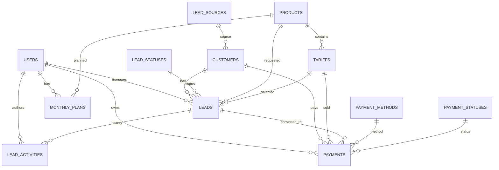

# CRM-Builder: обзор проекта и схема базы данных

## Что есть в проекте сейчас

Проект уже скачан как `pnpm`-монорепозиторий.

Основные части:

| Путь | Назначение |
| --- | --- |
| `artifacts/crm` | React/Vite фронтенд CRM. Страницы: логин, дашборд, лиды, платежи, рабочее место менеджера, планирование, сотрудники. |
| `artifacts/api-server` | Express API. Авторизация через сессию, CRUD для лидов, платежей, планов и сотрудников, отчеты для дашборда. |
| `lib/db` | PostgreSQL + Drizzle ORM. Здесь текущая схема таблиц. |
| `lib/api-spec` | OpenAPI-контракт API. Из него генерируются клиентские хуки и Zod-схемы. |
| `lib/api-zod` | Сгенерированные Zod-схемы для проверки входных и выходных данных API. |
| `lib/api-client-react` | Сгенерированный React API-клиент. |
| `attached_assets` | Исходные материалы и импортированные файлы, включая Excel с запуском за январь-февраль. |

Текущая база уже содержит 5 таблиц:

| Таблица | Роль |
| --- | --- |
| `users` | Сотрудники, роли, логины, парольные хэши, зарплата и параметры бонусов. |
| `leads` | Лиды/сделки, клиентские контакты, статус, продукт, тариф, сумма, прибыль, менеджер. |
| `payments` | Платежи и выручка по клиентам/менеджерам. |
| `plans` | Месячные планы менеджеров. |
| `activities` | История заметок и действий по лидам. |

## Что стоит улучшить в модели

Текущая схема хороша для первого прототипа, но для рабочей CRM ее лучше нормализовать:

- Клиента стоит вынести из `leads` и `payments` в отдельную таблицу `customers`.
- Продукты, тарифы, источники, статусы и методы оплаты лучше хранить как справочники, а не произвольные строки.
- Денежные значения лучше хранить как `numeric(14,2)`, а не `real`, чтобы не ловить ошибки округления.
- `payment_date` и `month` лучше хранить как `date`, а не `text`.
- В таблицах должны быть внешние ключи, индексы для фильтров и защита от удаления связанных данных.
- Автоматически созданный платеж из лида должен ссылаться на исходный `lead_id`.

## Целевая ER-схема

## Таблицы

### `users`

Сотрудники CRM: администраторы и менеджеры.

| Поле | Тип | Назначение |
| --- | --- | --- |
| `id` | `serial primary key` | Идентификатор пользователя. |
| `name` | `text not null` | Имя сотрудника. |
| `role` | `text not null` | `admin` или `manager`. |
| `username` | `text not null unique` | Логин. |
| `password_hash` | `text not null` | Хэш пароля. |
| `salary` | `numeric(14,2)` | Оклад. |
| `base_bonus` | `numeric(14,2)` | Базовый бонус. |
| `bonus_multiplier` | `numeric(8,3)` | Множитель бонуса. |
| `default_min_plan` | `numeric(14,2)` | План минимум по умолчанию. |
| `default_target_plan` | `numeric(14,2)` | Целевой план по умолчанию. |
| `default_max_plan` | `numeric(14,2)` | Максимальный план по умолчанию. |
| `is_active` | `boolean not null default true` | Можно ли входить в систему. |
| `created_at` | `timestamptz not null default now()` | Дата создания. |
| `updated_at` | `timestamptz not null default now()` | Дата обновления. |

Индексы:

- `unique(username)`
- `index(role)`
- `index(is_active)`

### `customers`

Единая карточка клиента. Один клиент может иметь несколько лидов и платежей.

| Поле | Тип | Назначение |
| --- | --- | --- |
| `id` | `serial primary key` | Идентификатор клиента. |
| `full_name` | `text not null` | Имя клиента. |
| `phone` | `text` | Телефон. |
| `telegram` | `text` | Telegram. |
| `email` | `text` | Email. |
| `source_id` | `integer references lead_sources(id)` | Источник привлечения. |
| `income_segment` | `text` | Сегмент дохода, если нужен в продажах. |
| `notes` | `text` | Общие заметки по клиенту. |
| `created_at` | `timestamptz not null default now()` | Дата создания. |
| `updated_at` | `timestamptz not null default now()` | Дата обновления. |

Индексы:

- `index(phone)`
- `index(telegram)`
- `index(email)`
- `index(source_id)`

### `lead_sources`

Справочник источников лидов.

| Поле | Тип | Назначение |
| --- | --- | --- |
| `id` | `serial primary key` | Идентификатор источника. |
| `name` | `text not null unique` | Название: реклама, рекомендации, блог, вебинар и т.д. |
| `is_active` | `boolean not null default true` | Доступен ли источник для выбора. |

### `products`

Справочник продуктов.

| Поле | Тип | Назначение |
| --- | --- | --- |
| `id` | `serial primary key` | Идентификатор продукта. |
| `name` | `text not null unique` | Название продукта. |
| `description` | `text` | Описание. |
| `is_active` | `boolean not null default true` | Доступен ли продукт. |
| `created_at` | `timestamptz not null default now()` | Дата создания. |

### `tariffs`

Тарифы внутри продуктов.

| Поле | Тип | Назначение |
| --- | --- | --- |
| `id` | `serial primary key` | Идентификатор тарифа. |
| `product_id` | `integer not null references products(id)` | Продукт. |
| `name` | `text not null` | Название тарифа. |
| `default_price` | `numeric(14,2)` | Базовая цена. |
| `default_net_profit` | `numeric(14,2)` | Ожидаемая чистая прибыль. |
| `is_active` | `boolean not null default true` | Доступен ли тариф. |

Ограничения:

- `unique(product_id, name)`

### `lead_statuses`

Справочник статусов воронки.

| Поле | Тип | Назначение |
| --- | --- | --- |
| `code` | `text primary key` | Код статуса: `new`, `in_progress`, `paid`, `lost`. |
| `name` | `text not null` | Человекочитаемое название. |
| `sort_order` | `integer not null` | Порядок в канбане/воронке. |
| `is_won` | `boolean not null default false` | Успешный финальный статус. |
| `is_lost` | `boolean not null default false` | Проигранный финальный статус. |

### `leads`

Сделки/лиды в воронке продаж.

| Поле | Тип | Назначение |
| --- | --- | --- |
| `id` | `serial primary key` | Идентификатор лида. |
| `customer_id` | `integer not null references customers(id)` | Клиент. |
| `manager_id` | `integer not null references users(id)` | Ответственный менеджер. |
| `product_id` | `integer references products(id)` | Интересующий продукт. |
| `tariff_id` | `integer references tariffs(id)` | Тариф. |
| `status_code` | `text not null references lead_statuses(code)` | Статус воронки. |
| `expected_revenue` | `numeric(14,2)` | Ожидаемая выручка. |
| `expected_net_profit` | `numeric(14,2)` | Ожидаемая чистая прибыль. |
| `expected_payment_date` | `date` | Ожидаемая дата оплаты. |
| `payment_type` | `text` | Планируемый тип/вариант оплаты. |
| `notes` | `text` | Заметки по сделке. |
| `created_at` | `timestamptz not null default now()` | Дата создания. |
| `updated_at` | `timestamptz not null default now()` | Дата обновления. |
| `closed_at` | `timestamptz` | Дата закрытия сделки. |

Индексы:

- `index(manager_id, status_code)`
- `index(customer_id)`
- `index(product_id)`
- `index(tariff_id)`
- `index(expected_payment_date)`
- `index(created_at)`

### `lead_activities`

История действий по лиду: заметки, смены статуса, звонки, задачи.

| Поле | Тип | Назначение |
| --- | --- | --- |
| `id` | `serial primary key` | Идентификатор активности. |
| `lead_id` | `integer not null references leads(id) on delete cascade` | Лид. |
| `author_id` | `integer references users(id)` | Автор. |
| `type` | `text not null default 'note'` | `note`, `status_change`, `call`, `message`, `task`. |
| `content` | `text not null` | Текст события. |
| `from_status_code` | `text references lead_statuses(code)` | Старый статус. |
| `to_status_code` | `text references lead_statuses(code)` | Новый статус. |
| `due_at` | `timestamptz` | Срок задачи. |
| `completed_at` | `timestamptz` | Дата выполнения задачи. |
| `created_at` | `timestamptz not null default now()` | Дата создания. |

Индексы:

- `index(lead_id, created_at)`
- `index(author_id)`
- `index(due_at)`

### `payment_methods`

Справочник способов оплаты.

| Поле | Тип | Назначение |
| --- | --- | --- |
| `id` | `serial primary key` | Идентификатор способа оплаты. |
| `name` | `text not null unique` | Название: карта, перевод, рассрочка, счет и т.д. |
| `is_active` | `boolean not null default true` | Доступен ли способ. |

### `payment_statuses`

Справочник статусов платежей.

| Поле | Тип | Назначение |
| --- | --- | --- |
| `code` | `text primary key` | Код: `pending`, `paid`, `partial`, `refunded`, `cancelled`. |
| `name` | `text not null` | Название статуса. |
| `sort_order` | `integer not null default 0` | Порядок отображения. |

### `payments`

Фактические платежи. Используются для выручки, чистой прибыли, план-факта и отчетов.

| Поле | Тип | Назначение |
| --- | --- | --- |
| `id` | `serial primary key` | Идентификатор платежа. |
| `lead_id` | `integer references leads(id)` | Сделка, если платеж родился из лида. |
| `customer_id` | `integer not null references customers(id)` | Клиент. |
| `manager_id` | `integer not null references users(id)` | Ответственный менеджер. |
| `tariff_id` | `integer references tariffs(id)` | Проданный тариф. |
| `order_number` | `integer` | Номер заказа. |
| `revenue` | `numeric(14,2) not null` | Выручка. |
| `net_profit` | `numeric(14,2)` | Чистая прибыль. |
| `receivable` | `numeric(14,2)` | Дебиторка/остаток к получению. |
| `payment_method_id` | `integer references payment_methods(id)` | Способ оплаты. |
| `paid_at` | `date not null` | Дата оплаты. |
| `payment_schedule` | `text` | График платежей, если нужен в свободной форме. |
| `status_code` | `text not null references payment_statuses(code)` | Статус платежа. |
| `created_at` | `timestamptz not null default now()` | Дата создания. |
| `updated_at` | `timestamptz not null default now()` | Дата обновления. |

Индексы:

- `index(manager_id, paid_at)`
- `index(customer_id)`
- `index(lead_id)`
- `index(tariff_id)`
- `index(status_code)`
- `index(paid_at)`

### `monthly_plans`

Планы продаж по менеджерам, месяцам и опционально продуктам.

| Поле | Тип | Назначение |
| --- | --- | --- |
| `id` | `serial primary key` | Идентификатор плана. |
| `manager_id` | `integer not null references users(id)` | Менеджер. |
| `month` | `date not null` | Первый день месяца, например `2026-07-01`. |
| `product_id` | `integer references products(id)` | Продукт, если план продуктовый. |
| `min_plan` | `numeric(14,2) not null` | Минимальный план. |
| `target_plan` | `numeric(14,2) not null` | Целевой план. |
| `max_plan` | `numeric(14,2) not null` | Максимальный план. |
| `created_at` | `timestamptz not null default now()` | Дата создания. |
| `updated_at` | `timestamptz not null default now()` | Дата обновления. |

Ограничения:

- `unique(manager_id, month, product_id)`

Индексы:

- `index(month)`
- `index(manager_id, month)`

### `audit_log`

Технический журнал важных изменений.

| Поле | Тип | Назначение |
| --- | --- | --- |
| `id` | `bigserial primary key` | Идентификатор события. |
| `actor_id` | `integer references users(id)` | Кто сделал изменение. |
| `entity_type` | `text not null` | Тип сущности: `lead`, `payment`, `user`. |
| `entity_id` | `integer not null` | ID сущности. |
| `action` | `text not null` | Действие: `create`, `update`, `delete`, `login`. |
| `before` | `jsonb` | Состояние до изменения. |
| `after` | `jsonb` | Состояние после изменения. |
| `created_at` | `timestamptz not null default now()` | Дата события. |

Индексы:

- `index(entity_type, entity_id)`
- `index(actor_id, created_at)`

## Представления для отчетов

### `vw_manager_monthly_stats`

Агрегирует факт по менеджерам и месяцам:

| Поле | Источник |
| --- | --- |
| `manager_id` | `payments.manager_id` |
| `month` | `date_trunc('month', payments.paid_at)` |
| `revenue` | `sum(payments.revenue)` |
| `net_profit` | `sum(payments.net_profit)` |
| `deals` | `count(payments.id)` |
| `average_check` | `avg(payments.revenue)` |

### `vw_lead_conversion`

Считает конверсию лидов в оплату:

| Поле | Источник |
| --- | --- |
| `month` | `date_trunc('month', leads.created_at)` |
| `manager_id` | `leads.manager_id` |
| `total_leads` | `count(leads.id)` |
| `paid_leads` | `count(*) filter where lead_statuses.is_won` |
| `conversion_rate` | `paid_leads / total_leads * 100` |

## Минимальный путь миграции

1. Сначала добавить внешние ключи к текущим таблицам: `manager_id -> users.id`, `lead_id -> leads.id`, `author_id -> users.id`.
2. Перевести денежные поля `price`, `net_profit`, `revenue`, `receivable`, `salary`, планы и бонусы с `real` на `numeric(14,2)`.
3. Перевести `payment_date` и `plans.month` из `text` в `date`.
4. Создать справочники `lead_statuses`, `products`, `tariffs`, `payment_methods`, `payment_statuses`.
5. Вынести повторяющиеся данные клиента из `leads` и `payments` в `customers`.
6. Добавить `lead_id` в `payments`, чтобы оплата была связана с исходной сделкой.
7. Добавить индексы под фильтры, которые уже есть в API: менеджер, статус, тариф, месяц, поиск.

## Почему такая база подходит проекту

Эта схема закрывает текущие страницы CRM и оставляет запас на развитие:

- `dashboard` получает быстрые и точные KPI из `payments`, `monthly_plans` и отчетных представлений.
- `leads` получает нормальную воронку, историю действий и связь с клиентом.
- `payments` становится источником финансовой правды, а не копией строк из лида.
- `planning` работает по менеджерам, месяцам и продуктам.
- `employees` остается простой таблицей пользователей, но с готовностью к расширению ролей и прав.
- `workspace` менеджера может показывать открытые сделки, задачи, бонус и прогресс к плану без тяжелой логики на фронтенде.
